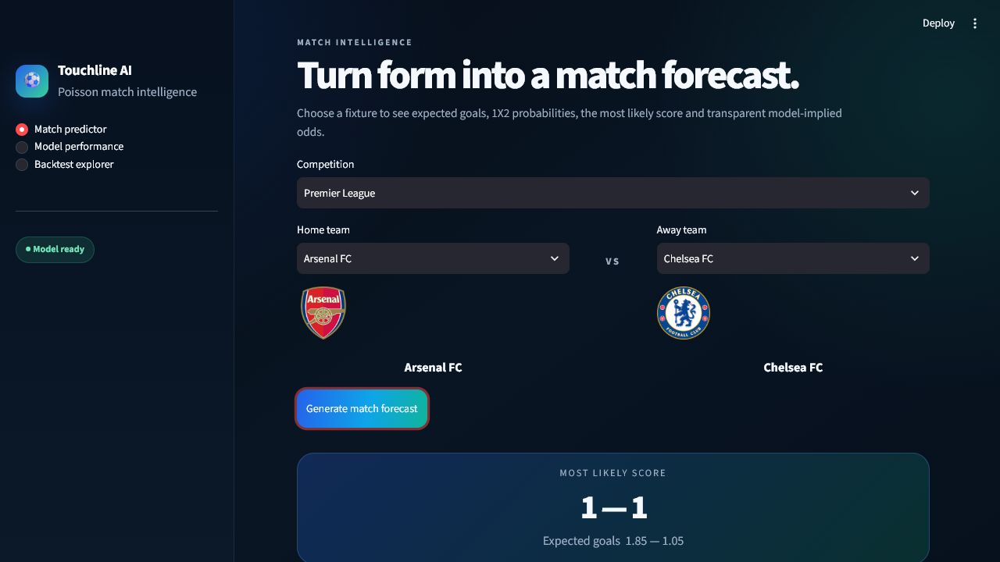
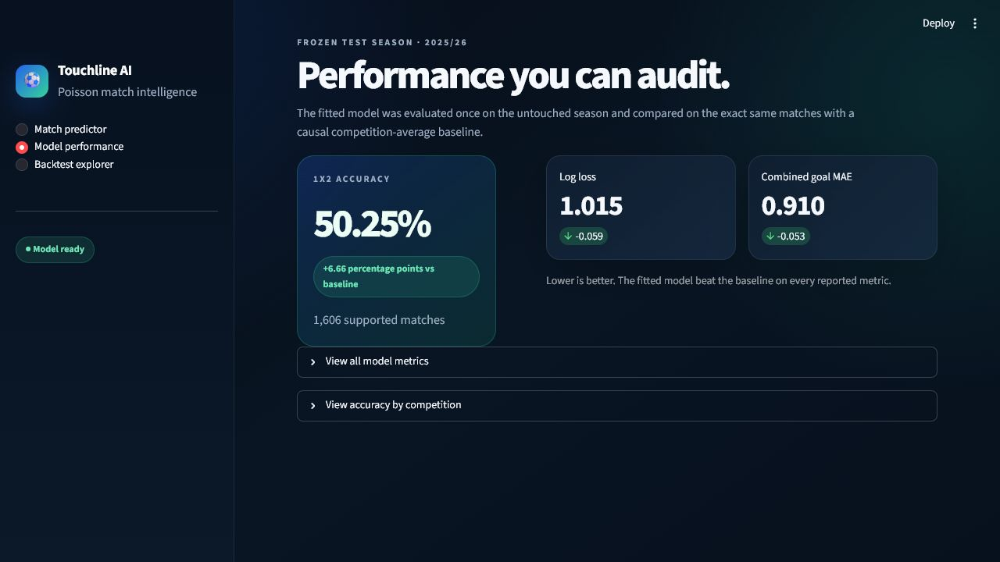

# Football Match Prediction

This project predicts football results using two Poisson regression models. A
Poisson model is useful when the output is a count, such as the number of goals:

- one model predicts the expected home goals, `lambda_home`;
- one model predicts the expected away goals, `lambda_away`.

The project covers the Premier League, Bundesliga, Ligue 1, Serie A, and La Liga.
The same pair of models covers all five competitions. The league is also given to
the model, because scoring levels can be different between leagues.

## Dashboard preview

Choose two teams to see the predicted score, expected goals, result probabilities
and model-based decimal odds.



The performance page shows the final test result and compares it with the simple
league-average predictor.



## Workflow

```text
historical matches
-> calculate recent and season form
-> home and away Poisson regressions
-> try a few model settings
-> save the settings that worked best
-> test once on the unused 2025/26 season
-> compare with a simple league-average predictor
-> predict future fixtures
```

There are no hand-written boosts for favourites or draws. The probabilities come
directly from the fitted models.

## Data roles

The data is split into three parts, and each part has a different job:

1. Older StatsBomb matches teach the models how goals relate to team form.
2. football-data.org 2024/25 is used to choose the best settings.
3. football-data.org 2025/26 is kept aside for the final test.

The final test season is treated like a final exam. It cannot help choose the
model or its settings. After a 2025/26 match has happened, its result can be used
when predicting later matches. The fitted model itself is not trained again.

The synchronization, API, caching, and parsing code is kept separately under
`src/football_prediction/data/`. The main modelling steps are kept outside that
folder so they are easier to read.

## Features

For each match, the feature builder calculates:

- rolling goals scored and conceded by both teams;
- season-to-date goals scored and conceded by both teams;
- the competition.

The rolling window controls how many recent matches represent current form. A
window of 3 reacts quickly, while a window of 8 is steadier.

The model must not see a result before making its prediction. The code therefore
calculates every match on one date before adding that date's results to team
history. In machine learning this mistake is called data leakage.

Both teams need at least three earlier matches in the current season. Matches
without enough history are skipped instead of being filled with guessed values.

## Poisson regressions

The models use three steps from scikit-learn:

1. `StandardScaler` puts the eight numerical inputs on similar scales.
2. `OneHotEncoder` tells the model which league a match belongs to.
3. `PoissonRegressor` learns the expected number of goals.

The `alpha` setting controls how much the model is kept from fitting too closely
to the training matches. This is called regularization and can help the model
avoid learning random noise. I tried these settings:

```text
rolling window: 3, 5, 8
alpha:          0.01, 0.1, 1.0
```

All nine results are shown. After choosing the best settings, the model learns
from the older data and 2024/25 together. It is then saved for testing and future
predictions.

## Final selected model and test result

The best settings on the 2024/25 data were:

```text
rolling window: 3
alpha: 0.1
validation log loss: 1.0119
```

I then tested the saved model once on 1,606 usable matches from 2025/26, covering
12 September 2025 through 24 May 2026.

| Metric | Fitted model | Competition-average baseline |
|---|---:|---:|
| Multiclass log loss | 1.0151 | 1.0742 |
| Multiclass Brier score | 0.6073 | 0.6498 |
| 1X2 accuracy | 50.25% | 43.59% |
| Home-goal MAE | 0.9682 | 1.0258 |
| Away-goal MAE | 0.8512 | 0.8999 |
| Combined goal MAE | 0.9097 | 0.9628 |

The fitted model beat the simple league-average predictor on every measurement.
The settings were already chosen before these results were viewed, and I did not
change them afterwards.

Accuracy is the percentage of correct home, draw or away choices. MAE is the
average difference between predicted and actual goals. Log loss and Brier score
judge the full set of probabilities, so a confident wrong prediction is punished
more strongly. Lower values are better for all three error measurements.

## Result probabilities

Each model produces a Poisson lambda. This is simply its expected number of goals.
The code works out the probability of every score from 0-0 through 10-10. It then
adds the relevant scores together to get:

- home-win probability;
- draw probability;
- away-win probability.

There is a very small chance of a team scoring more than ten, so the probabilities
are adjusted slightly to make sure they total 100%. The score with the highest
individual probability is shown as the most likely score. The same inputs always
give the same result.

## Draw analysis

The model did not choose a draw as its final answer for any test match. I tried
multiplying the draw probability by `1.40` when choosing the answer. I did not keep
this change because it made the overall result worse:

| Metric | Original decision | Draw-adjusted decision |
|---|---:|---:|
| Log loss | 1.0151 | 1.0151 |
| Brier score | 0.6073 | 0.6073 |
| 1X2 accuracy | 50.25% | 49.81% |
| Predicted draws | 0 | 61 |
| Correctly predicted draws | 0 | 13 |
| Draw recall | 0% | 3.1% |
| Draw precision | Not applicable | 21.3% |

Log loss and Brier score stayed the same because the experiment changed only the
final choice, not the probabilities themselves. It correctly found 13 draws, but
it also changed even more correct home or away predictions into wrong ones. I
therefore kept the original rule and report the draw problem honestly instead of
forcing the model to predict draws.

## Published accuracy context

It is difficult to name one "best" football model because studies use different
leagues, seasons and data. Some also remove difficult matches or predict only two
possible results, which makes their accuracy look higher. For normal pre-match
home, draw or away prediction, strong published results are usually around
**52% to 55%**.

- A 2026 model reported **53.8%** accuracy on Premier League matches it had not
  trained on. The study described 52% to 55% as the published comparison range:
  [Frontiers in Applied Mathematics and Statistics](https://www.frontiersin.org/journals/applied-mathematics-and-statistics/articles/10.3389/fams.2026.1754408/full).
- A neural-network study reported **52.8%** accuracy across 2,589 matches with
  home, draw and away as the three possible answers:
  [Applied System Innovation](https://www.mdpi.com/2571-9394/6/4/57).
- In the 2023 Soccer Prediction Challenge, the combined bookmaker probabilities
  were better than the submitted machine-learning models:
  [Machine Learning](https://link.springer.com/article/10.1007/s10994-024-06625-9).
- One Premier League machine-learning study scored 0.2156 using a probability
  measurement called RPS. Bet365 and Pinnacle did better with 0.2012 on the same
  matches. Lower RPS is better:
  [International Journal of Forecasting](https://www.sciencedirect.com/science/article/pii/S0169207018300116).

This project is therefore a simple model that can be understood and explained. I
am not claiming it is one of the best models in the world. Its 50.25% accuracy is
below the strong published range of 52% to 55%, but it is clearly better than the
simple league-average comparison used in this project.

## Baseline and final backtest

The comparison model is deliberately simple. Before each match it calculates the
league's earlier average for:

- goals scored by home teams;
- goals scored by away teams.

It never uses the current result or a later result. Both models use the same
probability calculation and are tested on exactly the same matches.

The final report contains:

- probability error measured with log loss;
- probability error measured with Brier score;
- 1X2 accuracy;
- average home-goal error (MAE);
- average away-goal error (MAE);
- average error across both goal models.

Lower log loss, Brier score and MAE are better. Higher accuracy is better. The
saved results also state whether the fitted model beats the simple comparison on
log loss.

## Installation

Python 3.10 or newer is required.

```powershell
python -m pip install -e ".[dev]"
```

For football-data.org downloads, create an ignored `.env` file in the project root:

```text
FOOTBALL_DATA_API_KEY=your_own_token
```

Never commit or print this token.

## Commands

Download or refresh StatsBomb data:

```powershell
python -m football_prediction.cli update-data
```

Download football-data.org 2024/25 and 2025/26:

```powershell
python -m football_prediction.cli update-football-data --seasons 2024 2025
```

Check the two files that record which data has been downloaded:

```powershell
python -m football_prediction.cli data-status
python -m football_prediction.cli football-data-status
```

Try all nine settings, train with the best ones and save the model:

```powershell
python -m football_prediction.cli tune-model
```

`train` is an alias for the same operation. Run one command, not both:

```powershell
python -m football_prediction.cli train
```

Evaluate the saved model once on 2025/26:

```powershell
python -m football_prediction.cli backtest
```

The final test refuses to overwrite an existing report. This helps prevent the
model from being repeatedly changed after looking at the final result.

Predict one future fixture:

```powershell
python -m football_prediction.cli predict `
  --home-team "Arsenal FC" `
  --away-team "Chelsea FC" `
  --competition "Premier League"
```

Launch the Streamlit dashboard:

```powershell
streamlit run app.py
```

The dashboard includes a match predictor with team crests, probabilities and
decimal odds. It also has a model-results page and a page for looking through past
predictions. The shown odds are calculated as `1 / probability`. They come from
the model and are not real bookmaker odds.

Run all tests:

```powershell
python -m pytest
```

## Output files

The model creates only three final output files:

```text
models/model.pkl
reports/backtest_predictions.csv
reports/metrics.json
```

The saved model file contains both goal models, the chosen settings, the input
columns, the last training date and the supported leagues.

## Main files

- `features.py`: calculates recent and season form. Match history is updated only
  after every match on that date has been prepared.
- `model.py`: fits both goal models, tries the nine settings and trains the final
  model without using the final test results.
- `probabilities.py`: turns the two expected-goal values into score and home, draw
  or away probabilities.
- `backtest.py`: compares the fitted model with the simple league average and saves
  the results.
- `prediction.py`: saves and loads the model and predicts one future match from the
  latest team history.
- `cli.py`: connects the data, training, backtest, and prediction commands.

## Limitations

- Football scores contain a lot of randomness, and recent goals may react slowly
  when a team becomes better or worse.
- The model assumes that home and away goals do not directly affect each other.
  This is what "independent Poisson variables" means.
- Injuries, line-ups, transfers, red cards and bookmaker odds are not used.
- StatsBomb does not contain the same number of seasons for every league.
- The older StatsBomb sample does not give Bundesliga teams enough earlier matches
  for training. The model learns Bundesliga information when the complete 2024/25
  season is added before the final test.
- Team IDs from the two data sources are kept separate because guessing matches
  between different ID systems could connect the wrong teams.
- A team needs three earlier matches in the current season before prediction.
- Future predictions need the exact team and league names found in the saved data.
- The dashboard displays the model's results but does not change its predictions.

## Development note

This README was written by GPT-5.6 Sol High based on internal dialogue about the
project's design, experiments and results. The data gathering and extraction code,
along with the user interface, was also created by GPT-5.6 Sol High.

Data sources: [StatsBomb Open Data](https://github.com/statsbomb/open-data) and
[football-data.org](https://www.football-data.org/).
